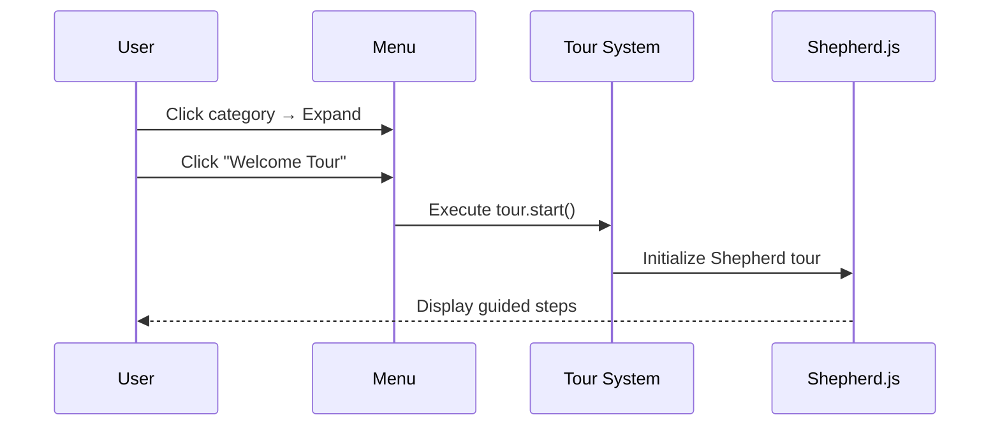
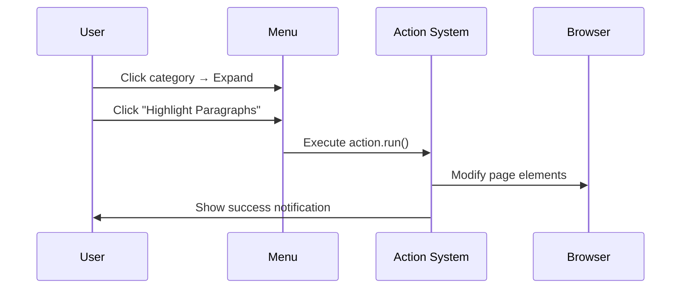

# DAP Extension

A Chrome extension that provides interactive guided tours and quick actions for the 3DExperience platform. Features a floating menu system with hierarchical organization and collapsible categories.

## ✨ Features

### 🎯 **Interactive Tours**
- **Shepherd.js-powered** guided tours with step-by-step navigation  
- **Hierarchical organization** with collapsible menu categories
- **Simplified configuration** - easy JSON-based tour definitions
- **Smart positioning** with automatic button generation

### ⚡ **Quick Actions**
- **Self-registering scripts** that execute client-side functionality
- **Organized by categories** with icons and descriptions
- **Global notification system** for user feedback
- **Modular architecture** for easy extension

### 🎨 **User Interface**
- **Floating menu icon** in bottom-right corner
- **Collapsible categories** - collapsed by default for clean UX
- **Responsive design** with smooth animations
- **Icon-based categorization** for visual organization

## 📦 Installation

### For Development:
1. **Clone the repository**
   ```bash
   git clone https://github.com/antoinemarchal/dap-extension
   cd dap-extension
   ```

2. **Load in Chrome**
   - Open Chrome and go to `chrome://extensions/`
   - Enable "Developer mode" (toggle in top-right)
   - Click "Load unpacked" and select the extension directory
   - The extension will automatically activate on `*.3dexperience.3ds.com` domains

### For Users:
- Extension activates automatically on 3DExperience platform domains
- No additional setup required

## 🏗️ Architecture

### **File Structure**
```
DAPExtension/
├── manifest.json              # Chrome extension configuration
├── init.js                   # Global hooks and initialization
├── content/
│   ├── content.js           # UI injection and menu toggle
│   └── ui.css              # Styling for floating icon and menu
├── ui/
│   ├── menu.js             # Hierarchical menu rendering
│   ├── icon.png           # Floating menu icon
│   └── icon.svg           # SVG version of icon
├── config/
│   └── tours.json         # Tour definitions and menu structure
├── scripts/                # Self-registering action scripts
│   ├── highlight-paragraphs.js
│   ├── show-element-info.js
│   ├── scroll-to-top.js
│   ├── toggle-images.js
│   └── focus-mode.js
├── loaders/
│   ├── tour-loader.js      # Dynamic tour loading
│   └── script-loader.js    # Action registration & notifications
├── libs/                   # External libraries
│   ├── shepherd.min.js
│   └── shepherd.min.css
└── icons.md               # Icon reference guide
```

### **Component Overview**

#### 🔧 **Core System**
- **`manifest.json`**: Extension configuration targeting `*.3dexperience.3ds.com`
- **`init.js`**: Global customization hooks via `window.DAPExtension`
- **`content/content.js`**: Injects floating icon and creates menu container
- **`ui/menu.js`**: Renders hierarchical menu with collapsible categories

#### 📚 **Tour System** 
- **`config/tours.json`**: Simplified tour definitions with menu categories
- **`loaders/tour-loader.js`**: Loads and registers tours dynamically
- **Tours register** in `window.DAP_TOURS` array with parent category references

#### ⚡ **Action System**
- **`scripts/*.js`**: Self-registering action scripts  
- **`loaders/script-loader.js`**: Provides global notification system
- **Actions register** in `window.DAP_ACTIONS` array with menu categories

## 📝 Usage

### **Adding a New Tour**

1. **Edit `config/tours.json`**:
   ```json
   {
     "menus": [
       {
         "id": "my-category",
         "label": "My Category", 
         "icon": "🎯",
         "order": 3
       }
     ],
     "tours": [
       {
         "label": "My New Tour",
         "description": "Description of what this tour covers",
         "parent": "my-category",
         "steps": [
           {
             "title": "Step Title",
             "text": "Step description", 
             "element": "CSS selector",
             "position": "left|right|top|bottom|center"
           }
         ]
       }
     ]
   }
   ```

### **Adding a New Action**

1. **Create script file** in `scripts/` directory:
   ```javascript
   // my-action.js
   (function() {
     if (!window.DAP_ACTIONS) window.DAP_ACTIONS = [];
     if (!window.DAP_MENUS) window.DAP_MENUS = [];

     function myAction() {
       // Your action code here
       showNotification('Action completed!', 'success');
     }

     // Register menu category (if new)
     const menuExists = window.DAP_MENUS.find(m => m.id === 'my-tools');
     if (!menuExists) {
       window.DAP_MENUS.push({
         id: 'my-tools',
         label: 'My Tools',
         icon: '🛠️',
         order: 5
       });
     }

     // Register action
     window.DAP_ACTIONS.push({
       id: 'my-action',
       label: 'My Action',
       description: 'What this action does',
       parent: 'my-tools',
       run: myAction
     });
   })();
   ```

2. **Add to manifest.json**:
   ```json
   "content_scripts": [{
     "js": [
       // ... existing scripts
       "scripts/my-action.js",
       // ... rest of scripts
     ]
   }]
   ```

### **Using Icons**
See [`icons.md`](icons.md) for a comprehensive list of copy-paste ready icons organized by category.

## 🎛️ Customization Hooks

The extension provides customization hooks via `window.DAPExtension`:

```javascript
window.DAPExtension = {
  onMenuOpen: (menuElement) => {
    console.log('Menu opened', menuElement);
  },
  onTourStart: (tour) => {
    console.log('Tour started', tour);
  },
  onActionRun: (action) => {
    console.log('Action executed', action);
  }
};
```

## 🔄 Architecture Patterns

### **Self-Registration Pattern**
Scripts automatically register themselves when loaded, avoiding the need for external configuration files.

### **Hierarchical Menu System** 
- **Menus** define categories with icons and ordering
- **Items** (tours/actions) reference parent categories
- **Collapsible interface** for better organization

### **Event-Driven Updates**
Menu re-renders when `dap-update-menu` event is dispatched.

### **Global Utilities**
- `window.showNotification(message, type)` - Consistent notifications
- `window.DAP_TOURS[]` - Tour registry
- `window.DAP_ACTIONS[]` - Action registry  
- `window.DAP_MENUS[]` - Menu category registry

## 🎯 Use Cases

### **Launching a Tour**


### **Running an Action**


## 🛠️ Development

### **No Build Process Required**
- Files are loaded directly by Chrome
- Changes take effect on extension reload
- Test directly on `*.3dexperience.3ds.com` domains

### **Testing**
1. Make changes to files
2. Go to `chrome://extensions/`
3. Click reload button on DAP Extension
4. Test on target domain

### **Debugging**
- Use Chrome DevTools Console for logs
- Extension logs are prefixed with "DAP Extension:"
- Check manifest.json for proper file loading order

## 📄 License

This project is licensed under the MIT License.

## 👤 Author

**Antoine Marchal**
- GitHub: [@antoinemarchal](https://github.com/antoinemarchal)
- Project: [dap-extension](https://github.com/antoinemarchal/dap-extension)

## 🤝 Contributing

1. Fork the repository
2. Create a feature branch
3. Make your changes
4. Test on target domain
5. Submit a pull request

For questions or issues, please use the GitHub issue tracker.