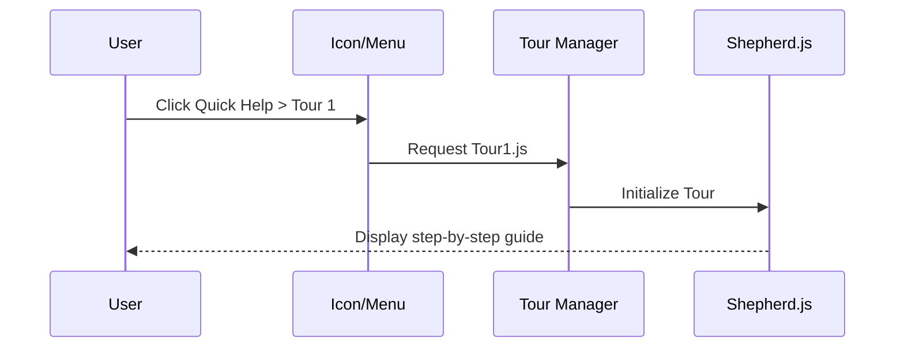
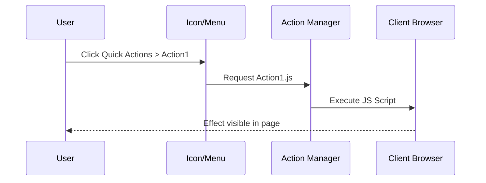

# Plan: DAP-like Chrome Extension for example.com

## Objectives
- Create a Chrome extension that activates only on `example.com`.
- Provide a floating icon in the bottom-right corner.
- Open a menu with submenus:
  - **Quick Help** → list of Shepherd.js tours.
  - **Quick Actions** → list of predefined client-side scripts.
- Keep modular organization with dedicated JS files for tours and scripts.
- Add `init.js` for initialization and frontend customization.
- Use external libraries (e.g., Shepherd.js).

---

## File Structure
```
DAPExtension/
│── manifest.json
│── init.js
│── content/
│   ├── content.js         # Injects UI and handles interactions
│   ├── ui.css             # Styles for floating icon and menu
│── ui/
│   ├── menu.js            # Menu logic
│   ├── icon.png           # Floating icon image
│── tours/
│   ├── tour1.js
│   ├── tour2.js
│── actions/
│   ├── action1.js
│   ├── action2.js
│── libs/
│   ├── shepherd.min.js
│   ├── shepherd.min.css
```

---

## TODO List

### 1. Core Setup
- [ ] Create `manifest.json` with permissions, content scripts, and activation on `example.com`.
- [ ] Add `init.js` for extension initialization and customization.

### 2. UI
- [ ] Implement floating icon (bottom-right).
- [ ] Build menu with:
  - [ ] Submenu **Quick Help** (list Shepherd.js tours).
  - [ ] Submenu **Quick Actions** (list scripts).

### 3. Quick Help (Shepherd.js)
- [ ] Import Shepherd.js in `libs/`.
- [ ] Define tours in `tours/` folder.
- [ ] Dynamically load and execute tours when selected.

### 4. Quick Actions
- [ ] Store reusable JS scripts in `actions/` folder.
- [ ] Load and execute selected action scripts on client-side.

### 5. Integration
- [ ] Wire `init.js` to manage:
  - Menu rendering
  - Event listeners
  - Loading tours/actions
  - Customization hooks

### 6. Packaging & Testing
- [ ] Package extension.
- [ ] Test on `example.com`.
- [ ] Validate UI and functionality.

---

## Notes
- Shepherd.js is required (include from CDN or local `libs/` folder).
- Extension is modular for easy addition of new tours/actions.

---

## Architecture (Mermaid Diagram)
```mermaid
flowchart TD
    A[manifest.json] --> B[content/content.js]
    B --> C[ui/menu.js]
    C --> D1[Quick Help (tours/)]
    C --> D2[Quick Actions (actions/)]
    D1 --> E1[Shepherd.js (libs/)]
    D2 --> E2[Client Scripts]
    B --> F[init.js]
```

---

## Use Case: Launching a Shepherd Tour


---

## Use Case: Running a Quick Action
